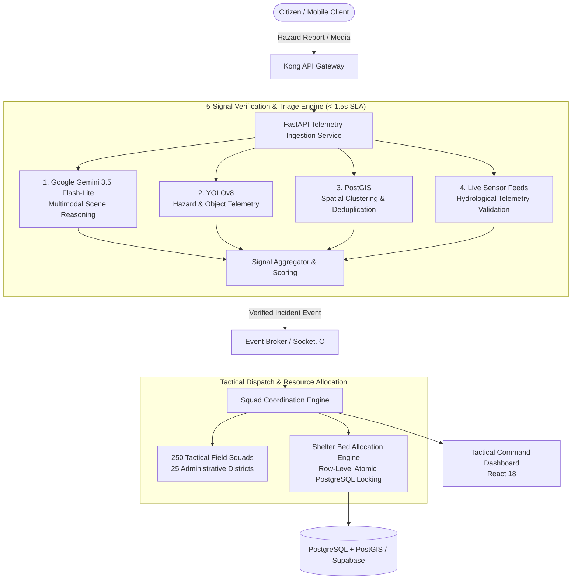

# CivicGuard 🛡️
> Disaster Response & Emergency Intelligence Platform

A high-concurrency, event-driven microservices platform engineered to orchestrate nationwide disaster response operations, automate hazard verification, and coordinate tactical field squads across administrative districts.

---

## 📌 Project Overview

- **Repository**: [github.com/savindu-st/CivicGuard](https://github.com/savindu-st/CivicGuard)
- **Status**: Active / Production-Ready Prototype
- **Role**: Lead Systems & Backend Architect

CivicGuard bridges citizen emergency reporting and tactical field dispatch through an automated, multimodal verification and resource coordination pipeline. It processes multi-source hazard signals, validates incoming citizen data against physical telemetry, and prevents shelter over-allocation during mass evacuation events.

---

## 🏗️ System Architecture

> [!NOTE]
> **Architecture Details to Update**:
> *Add specific service discovery, container topology, Kafka/RabbitMQ topics, and circuit-breaker patterns here.*

---

## ⚡ Key Features & Engineering Highlights

### 1. 5-Signal Hybrid Verification Engine (< 1.5s SLA)
Couples multimodal reasoning with spatial telemetry to combat false alarms and duplicate citizen hazard submissions:
1. **Multimodal Scene Triage**: Google Gemini 3.5 Flash-Lite evaluates image/video context, damage severity, and situational validity.
2. **Spatial Telemetry**: YOLOv8 extracts bounding boxes and detects specific hazard types (flood water levels, collapsed structures, fire).
3. **Geospatial Clustering**: PostGIS clusters spatial coordinates to deduplicate concurrent citizen calls for the same event.
4. **Hydrological Stream Validation**: Validates reported flooding against live telemetry feeds from regional hydrological sensors.
5. **Atomic Dispatch**: Triggers automated triage status and assigns priority weighting.

### 2. Atomic Bed Reservation & Concurrency Management
- Prevents race-condition over-allocation across evacuation shelters during sudden population surges.
- Uses PostgreSQL transactional row-level locking (`SELECT ... FOR UPDATE`) to guarantee zero double-booking under high concurrent load.

### 3. Tactical Command Coordination
- Coordinated **250 tactical field squads** across **25 simulated administrative districts**.
- Real-time updates delivered to command centers using WebSockets / Socket.IO.

---

## 📊 Key Metrics

| Metric | Measurement / Specification |
| :--- | :--- |
| **Inference & Triage SLA** | `< 1.5s` end-to-end response time |
| **Tactical Coordination** | 250 Field Squads across 25 Districts |
| **Data Integrity** | Zero race condition over-allocations (Row-level atomic locks) |
| **Geospatial Processing** | Millisecond spatial indexing via PostGIS |

---

## 🛠️ Tech Stack & Technologies

- **Backend & Microservices**: Node.js, Express, Python, FastAPI
- **Gateway & Ingestion**: Kong API Gateway
- **Frontend & UI**: React 18, TypeScript, Socket.IO Client
- **AI / Computer Vision**: Google Gemini 3.5 Flash-Lite, YOLOv8
- **Database & Spatial**: PostgreSQL, PostGIS, Supabase
- **DevOps & Deployment**: Docker Compose, Containerized Services

---

## 📝 Planned Updates & Notes

- [ ] Add detailed system sequence diagrams for shelter bed checkout.
- [ ] Document Kong Gateway routing policies and rate-limiting rules.
- [ ] Include benchmark latency curves across varying incident loads.
