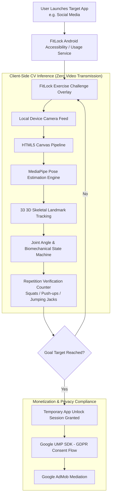

# FitLock 📱💪
> AI-Powered App Locker with On-Device Exercise Computer Vision

A cross-platform digital wellbeing application that locks user-selected target applications behind physical exercise challenges (squats, push-ups, jumping jacks), using real-time pose estimation.

---

## 📌 Project Overview

- **Google Play Store**: [play.google.com/store/apps/details?id=com.savindu.fitlock](https://play.google.com/store/apps/details?id=com.savindu.fitlock)
- **Status**: Live on Google Play Store
- **Role**: Creator & Full-Stack Mobile Developer

FitLock tackles phone addiction and sedentary screen time habits by converting screen unlocking into a physical workout barrier. When a user tries to access a restricted app, FitLock intercepts the launch and requires verified physical reps to grant temporary screen time.

---

## 🏗️ System Architecture

> [!NOTE]
> **Architecture Details to Update**:
> *Add specific joint angle kinematic formulas, state transitions (extension -> flexion -> lockout), and Android overlay permissions workflow.*

---

## ⚡ Key Features & Engineering Highlights

### 1. Zero-Latency On-Device Pose Tracking (MediaPipe Pose)
- Real-time kinematic tracking executed purely on the client via HTML5 Canvas and MediaPipe Pose.
- **Privacy First**: Zero video or camera frames are ever recorded, streamed, or uploaded to an external server. All computation occurs within device memory.
- **Joint Angle Kinematic Calculation**: Calculates 3D relative angles between hip, knee, ankle, shoulder, and elbow joints to differentiate partial reps from full range-of-motion repetitions.

### 2. Cross-Platform Hybrid Runtime
- Built with React, Vite, and Tailwind CSS encapsulated within Capacitor for high-efficiency native bridge communication.
- Native Android background services monitor foreground application lifecycle events to intercept target app launches seamlessly.

### 3. Monetization & Regulatory Compliance
- Fully integrated with the Google User Messaging Platform (UMP) SDK to ensure strict GDPR / ePrivacy directive compliance.
- Google AdMob integration with interstitial and rewarded video flows.

---

## 🛠️ Tech Stack & Technologies

- **Frontend & App Core**: React, Vite, Tailwind CSS
- **Native Runtime Bridge**: Capacitor, React Native
- **Computer Vision & AI**: Google MediaPipe Pose, WebGL / HTML5 Canvas
- **Monetization & Privacy**: Google AdMob SDK, Google UMP (User Messaging Platform)
- **Target OS**: Android (Google Play Distribution)

---

## 📝 Planned Updates & Notes

- [ ] Add mathematical breakdown of the rep calculation state machine.
- [ ] Document battery consumption optimization benchmarks during camera pose estimation.
- [ ] Add screenshots and UI design flow diagrams.
