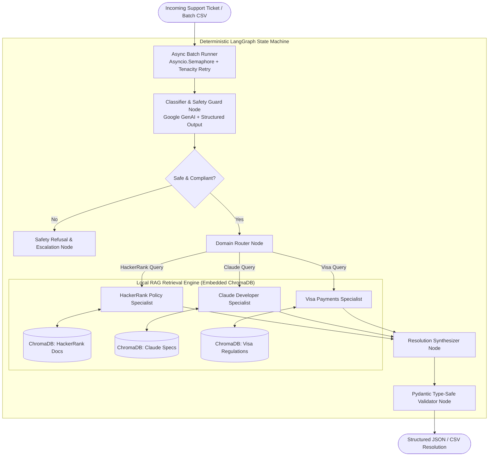

# HackerRank Orchestrate AI Agent 🤖
> Global Rank #81 / 1,400+ Submissions | Multi-Domain Deterministic AI Support Agent

An autonomous, multi-node agentic workflow built with LangGraph, ChromaDB, and Google Gemini to resolve customer support tickets across HackerRank, Claude, and Visa domains with zero web dependencies.

---

## 📌 Project Overview

- **Repository**: [github.com/savindu-st/hackerrank_orchestrate](https://github.com/savindu-st/hackerrank_orchestrate)
- **Competition**: HackerRank Orchestrate AI Agent Hackathon
- **Achievement**: **Global Rank #81** out of 1,400+ international submissions
- **Role**: AI Engineer & Systems Developer

The system automates the intake, domain routing, policy checking, knowledge grounding, and structured resolution of complex support requests across three distinct enterprise domains (HackerRank, Claude, Visa).

---

## 🏗️ System Architecture

> [!NOTE]
> **Architecture Details to Update**:
> *Add LangGraph State dictionary schema, embedding chunking strategy, and benchmark evaluation metrics.*

---

## ⚡ Key Features & Engineering Highlights

### 1. Deterministic State Machine (LangGraph)
- Structured multi-node workflow controlling state transitions between ticket classification, guardrail checks, domain knowledge retrieval, and output synthesis.
- Prevents uncontrolled LLM loops and enforces deterministic paths for sensitive policy-bound queries.

### 2. Fully Local Offline RAG Pipeline (ChromaDB + all-MiniLM-L6-v2)
- Multi-domain technical support manuals indexed into local embedded **ChromaDB** collections using HuggingFace's `all-MiniLM-L6-v2`.
- Guarantees 100% grounded answers strictly referencing indexed documentation without internet access or external search fallbacks.

### 3. Type-Safe Schema Enforcement (Pydantic `.with_structured_output`)
- Enforces strict JSON / CSV schema compliance for every triage decision and resolution output using Pydantic models.
- Guarantees valid field types, classification tags, confidence ratings, and rationale strings.

### 4. High-Throughput Resilience & Concurrency
- Implements `asyncio.Semaphore` bounded concurrency to process bulk ticket workloads while honoring strict rate limits.
- Incorporates `tenacity` exponential backoff retry policies for transient API hiccups.

---

## 🛠️ Tech Stack & Technologies

- **Agent Orchestration**: LangGraph, LangChain Core
- **LLM / Foundation Model**: Google GenAI (Gemini)
- **Vector Database**: Embedded ChromaDB
- **Embedding Model**: HuggingFace (`sentence-transformers/all-MiniLM-L6-v2`)
- **Data Validation & Typing**: Pydantic v2
- **Concurrency & Resilience**: Python `asyncio`, `tenacity`

---

## 📝 Planned Updates & Notes

- [ ] Include detailed prompt templates for domain specialists.
- [ ] Document ChromaDB indexing parameters (chunk size, overlap, similarity metrics).
- [ ] Add performance analysis against test challenge benchmarks.
