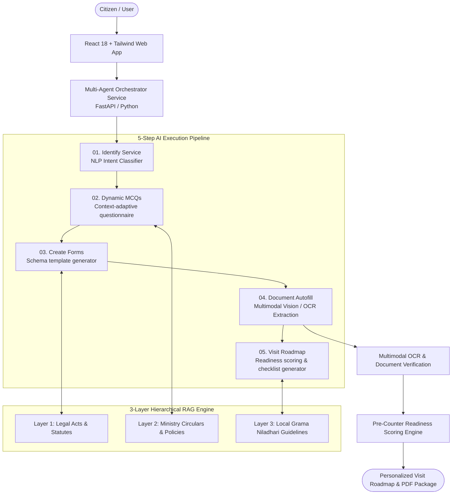

# PrajaNavigator 🏛️
> AI-Powered Public Administration & Citizen Insight Platform

A full-stack, multi-agent platform designed to modernize citizen-government interactions through multimodal OCR verification, dynamic situation assessment, hierarchical RAG knowledge retrieval, and automated document generation.

---

## 📌 Project Overview

- **Repository**: [github.com/savindu-st/AGENTRIX26-TEAM21-QuadNova](https://github.com/savindu-st/AGENTRIX26-TEAM21-QuadNova)
- **Competition / Team**: AGENTRIX 2026 / Team QuadNova
- **Status**: Completed / Hackathon Winner
- **Role**: AI Lead & Full-Stack Systems Architect

PrajaNavigator eliminates administrative friction, long counter queues, and incomplete documentation visits for citizens navigating bureaucratic administrative services.

---

## 🏗️ System Architecture

> [!NOTE]
> **Architecture Details to Update**:
> *Add specific multi-agent protocol schemas, OCR confidence thresholds, and conflict resolution rules between statutory layers.*

---

## ⚡ Key Features & Engineering Highlights

### 1. 5-Step Citizen Service AI Execution Flow
1. **Identify Service**: Discovers the exact government service or certificate needed from citizen descriptions in natural language.
2. **Dynamic MCQs**: Dynamically formulates conditional questionnaires to clarify unique citizen criteria (citizenship, age, eligibility exemptions).
3. **Create Forms**: Generates official standardized government application schemas and form drafts.
4. **Document Autofill**: Uses computer vision / OCR to extract citizen identity and proof data directly from uploaded photo IDs, utility bills, and certificates to autofill application fields.
5. **Visit Roadmap**: Compiles a pre-counter readiness score, personalized submission roadmap, office location guidelines, and physical document checklist.

### 2. 3-Layer Hierarchical RAG Architecture
- Resolves conflicts between national statutory law, ministry circular amendments, and localized administrative directives.
- Implements automated conflict-resolution nodes that prioritize recent gazette notifications over historical manuals.
- Supports offline fallback mode for local administrative hubs with intermittent connectivity.

### 3. Pre-Counter Readiness Scoring
- Assesses submission completeness before the citizen travels to the physical government office, eliminating repeat visits due to missing stamps, copies, or signatures.

---

## 🛠️ Tech Stack & Technologies

- **Frontend**: React, Tailwind CSS, Vite
- **Backend & Multi-Agent**: Python, FastAPI
- **Knowledge Retrieval**: Hierarchical RAG (Multi-index Vector Store)
- **Document Intelligence**: Multimodal OCR, Computer Vision Document Parser
- **Deployment**: Docker Compose, Containerized Microservices

---

## 📝 Planned Updates & Notes

- [ ] Add flowcharts detailing the automated conflict resolution logic between RAG layers.
- [ ] Document OCR preprocessing steps (deskewing, binarization, field mapping).
- [ ] Add benchmark results on form autofill precision and recall.
