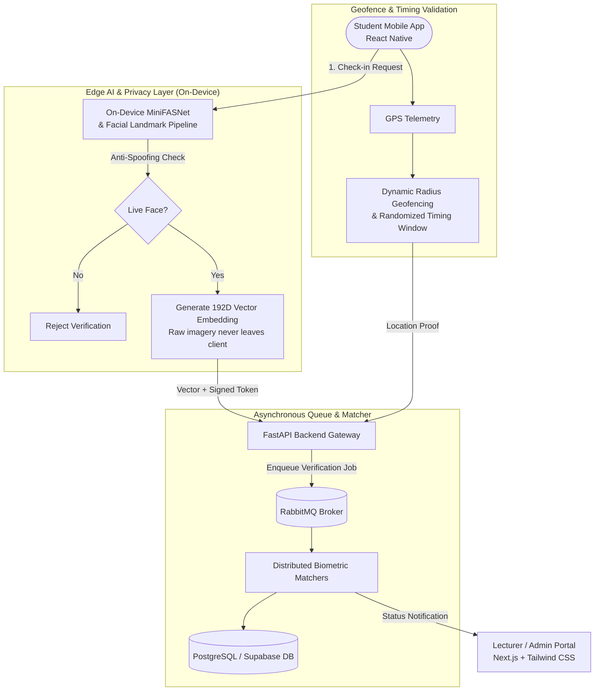

# Smart Attendance & Classroom Access Platform 🎓
> Enterprise-Grade Academic Biometric Attendance & Anti-Spoofing Verification System

A privacy-preserving, high-throughput microservices platform combining edge computer vision, randomized geofencing, and asynchronous message queues to eliminate proxy attendance in university environments.

---

## 📌 Project Overview

- **Organization / Repository**: [github.com/SmartAttendancePlatform-CS3202](https://github.com/SmartAttendancePlatform-CS3202)
- **Course / Initiative**: CS3202 Enterprise Application Development
- **Status**: Completed / Academic Production Platform
- **Role**: Lead Architect & Full-Stack Systems Engineer

The Smart Attendance Platform addresses vulnerabilities in traditional QR-code and roll-call attendance systems (such as proxy sign-ins, photo presentation attacks, and server-side choke points during simultaneous 500+ student check-ins).

---

## 🏗️ System Architecture

> [!NOTE]
> **Architecture Details to Update**:
> *Add specific database schemas, classroom beacon configurations, and RabbitMQ dead-letter exchange policies here.*

---

## ⚡ Key Features & Engineering Highlights

### 1. On-Device Edge AI & Anti-Spoofing (MiniFASNet)
- **Liveness Detection**: Runs MiniFASNet directly on the mobile device to detect presentation attacks (printed photos, phone screens, 3D masks) in real time.
- **Privacy-by-Design**: Computes 192-dimensional vector embeddings on-device. Raw biometric facial images or templates never leave the user's mobile device or touch network cables.

### 2. Multi-Signal Fraud Prevention
- **GPS Geofencing**: Validates student coordinates against room physical boundaries with dynamic jitter protection.
- **Randomized Verification Windows**: Attendance sessions open dynamically for unpredictable, short duration windows to stop remote or pre-planned fraud.

### 3. Distributed Asynchronous Matching (RabbitMQ)
- Solves the morning 8:00 AM classroom traffic burst problem (hundreds of simultaneous check-ins).
- Ingestion endpoints immediately acknowledge requests and enqueue jobs to **RabbitMQ**, enabling worker pools to match vectors against student registries smoothly without dropping connections or overloading PostgreSQL.

---

## 🛠️ Tech Stack & Technologies

- **Mobile Client**: React Native (iOS & Android)
- **Web / Admin Portal**: Next.js (React), Tailwind CSS
- **Backend API**: Python, FastAPI
- **Database & Auth**: PostgreSQL, Supabase
- **Message Broker & Queues**: RabbitMQ
- **Edge Vision & Anti-Spoofing**: MiniFASNet, On-Device Landmark Extraction (192D Embeddings)
- **Security & Geofencing**: Geolocation APIs, Cryptographic Request Signing

---

## 📝 Planned Updates & Notes

- [ ] Add latency benchmarks between synchronous vs. RabbitMQ queue processing.
- [ ] Detail student embedding enrollment and rotation policies.
- [ ] Add deployment guide for Dockerized RabbitMQ + FastAPI worker nodes.
